# Getting in Shape

Exercises for getting in shape with programming

## Motivation

I've worked as CTO since 2014, that's 10 years as of when I write these lines. My job is much more about corporate procedures than programming. The closest I am to programming is architecture or some specific code check once in a while. And don't get me wrong, I enjoy this work a lot, I manage a lot of people and resources to create technology, mostly software, which helps a lot of people around the world.

Some time ago I realized that as CTO it's a bad idea to write code for production purposes when your team is big enough, mainly because you will have no time to maintain and explain that code, especifically because software development is a rapidly growing discipline and it is very difficult to keep up with the new libraries, additions to programing languages and new specific technologies. 

The thing is that I miss programming, software problem solving, datastructures and mostly mathematical algorithms. And I don't want to lose that ability because I could use it in the future. Also programming is fun, very fun.

Furthermore, I know that nobody reads this, at least my repos, so this is a kind of self instrospection excersice, writing code and english. So please, if you have any comments be kind, remember that my native language is not English and I code just once in a while. Surely for experienced day-to-day programmers this repo will be silly or pretty basic, it is what it is.

## My personal Methodology

A few years ago I practiced Tai-Chi daily, about 3 hours per day. I practiced alone most of the time, I watched videos and read textbooks about Tai-Chi to improve my abilities. It was my personal kung-fu/tai-chi training, a way to improve myself with anykind of comparision with others. **This is the same**.

In this repository I practice something I like to call *katas*, which is not something I created, The coding dojo methodology is widely known around the programming community and as with Tai-Chi, I'll do this alone. I'm not interested in competing with anyone, I'm just competing with myself.

When I haven't mastered an excersise, algorithm or datastructure yet, I let only the explanation, I erase the code every time I practiced it to force myself to figure out again how to solve it until it feels natural for me.

About the file organization. I am writing these lines in an attempt to put a little order to this repository, so, if you review the commit history you'll find that the file structure is very messy or nonexistent. But I hope to fix this soon, so in the later versions you'll find more order.

A.

```mermaid
gitGraph
  commit id: "First commit"
  commit id: "More excercises and Helpers (Using VS Code to d..."
  commit id: "some typos"
  commit id: "Some changes and the .gitignore file"
  commit id: "Adding hanoi towers pseudocode and did some mod..."
  commit id: "Firt version of fibonacci with *memorization*, ..."
  commit id: "Adding memorization to fibonacciWithMemorizatio..."
  commit id: "Adding memorization explanation"
  commit id: "New aditions"
  commit id: "More helps like some basic itertools samples"
  commit id: "Adding a Simplelist example"
  commit id: "Adding stack and some changes to linkedList"
  commit id: ":bug: Bug solved in stack"
  commit id: "Adding Queues"
  commit id: "Moving exercises toa separated directory :file_..."
  commit id: "Removing the function annotations because linte..."
  commit id: "Some changes to the Simple Linkedlist to congru..."
  commit id: "Fixing some typo in linkedlist.py"
  commit id: "Adding DoubleÃLinkedList to linkedlist samples"
  commit id: "Some typo in queue.py"
  commit id: "Adding BinaryTree :deciduous_tree: to datastruc..."
  commit id: "Adding find functionality to binarytree.py"
  commit id: "Adding two ways of mergesort"
  commit id: "Adding two ways of mergesort"
  commit id: "Showing in-order, pre-order and post-order tran..."
  commit id: "Being specific with the printing transversal al..."
  commit id: "Adding BFS (Breath First Search) algorithm for ..."
  commit id: "Correction: BFS uses a queue FIFO"
  commit id: "Removing some useless comments"
  commit id: "Beautifying the algoritms"
  commit id: "Adding DFS Depth First Search algorithm to grap..."
  commit id: "Merge pull request #1 from Quantium/dependabot/..."
  commit id: "Hanoi towers"
  commit id: "New changes to Hanoi algoritms"
  commit id: "Merge pull request #5 from Quantium/dependabot/..."
  commit id: "Hanoi tower explained"
  commit id: "Adding Maximum Sum of a Subarray of k elements ..."
  commit id: "Fixing the assert to not expect the sorted arra..."
  commit id: "Taking out the graph and cleaning up a little bit"
  commit id: "t(docker): Containerizing and uploading to Dock..."
  commit id: "t(Window Algorithm): The window algorithm expla..."
  commit id: "vcontainers adn gitgraph generation in the READ..."
```

