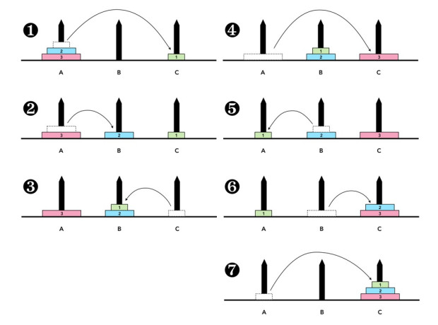

# Hanoi towers

## The Algorithm

The steps to solve any Hanoi tower are simple, once you solve it a few times. Look this image:



1. Move to your destination the disk on top of the tower first
2. Then move the next disk to the other peg, the one that is not the destination
3. Move the first disk on top of the last moved one to relase the space in the destination
4. Move the base of the tower to the destination peg
5. Move the peg on top of the tower to the available peg
6. Move the peg that follows, the one in the other peg (not the start nor the destination) on top of the base of the tower located in the destination peg
7. Finally move the little disk in the start peg on top of the tower

Seems easy, right? Can you see the pattern?

To understand the algorithm We need to think in terms of **Towers**, **Disks** and **Pegs**, giving a number to each peg *H{1,2,3}*, understand that this numbers will help to keep the order because the start, destination and "other" (or third) pegs will change any step of the algorithm

Having the pegs identified, the first step is not to move a disk, the task of the algorithm is to move the entire tower after all.

So the "real" first step is to tell the tower to move from the **start** peg to the **destination** peg, being the base of the tower the "boss" the next disk sequetienlly, so the greater disk is the boss of the next smaller one.  

> Then the "boss" (the base disk) checks if is the one on top of the tower, if not then ask the next one to move to the other peg so he can move to the destination.

### Mathematically

 Let  $H(n, A, B, C)$  be a function that describes the steps required to move $n$  disks from peg $A$ (start) to peg $C$ (target) using  $B$  as the auxiliary peg.

The recursive formula for the Tower of Hanoi can be expressed as follows:

```math
H(n, A, C, B) =
\begin{cases}
\text{Move 1 disk directly from } A \text{ to } C, & \text{if } n = 1 \\
H(n-1, A, B, C), \\
\text{Move disk } n \text{ from } A \text{ to } C, \\
H(n-1, B, C, A), & \text{if } n > 1
\end{cases}
```

Base Case $( n = 1 )$:

- If there is only 1 disk, move it directly from  $A$  to  $C$
- Recursive Case $( n > 1 )$:
- Move the top  $n-1$  disks from  $A$  to  $B$ , using  $C$  as the auxiliary peg. This is represented by  $H(n-1, A, B, C)$
- Move the  $n -th$ disk directly from  $A$  to  $C$
- Move the  $n-1$  disks from  $B$  to  $C$ , using  $A$  as the auxiliary peg. This is represented by  $H(n-1, B, C, A)$

### Finding the *other* peg

Given  $H(n, A, B, C)$  when  $C$  is the peg left out the move operation the *other*, but having the function $h(n,A,B)$ which assumes the *other* peg given the start and target only. What is the best way to identify the *other* peg?

Given the pegs with a numerical identifier the result is $H\{1,2,3\}$, so $ \sum_{} h_n = T $ and the total of pegs $P = 3$ So  $C = P - (A + B)$ exactly  $C = 6 - (A + B)$

### Pseudo Code

That's the algorithm itself. Expressing it in pseudo code:

- Being *n* the number of disks in the tower
- And *start* the peg when the tower is located at the begining
- And *target* the destination peg to move the tower

```{r, eval = FALSE}
move_the_tower_of_(n)_disks from the start peg to the target peg:
    If there is only one disk to move in the start, then:
       move_the_(n)_disk* from start to target
If not, then:
    move_the_tower_of_(n-1)_disks from the start peg to the other peg
    move_the_(n)_disk from start to target
    move_the_tower_of_(n-1)_disks from the other peg to the target peg
```

```math
H(n, A, C, B) =
\begin{cases}
\text{Move 1 disk directly from } A \text{ to } C, & \text{if } n = 1 \\
H(n-1, A, B, C), \\
\text{Move disk } n \text{ from } A \text{ to } C, \\
H(n-1, B, C, A), & \text{if } n > 1
\end{cases}
```

The function move_the_tower_of_(n) is the one that is recursive, going from the nth disk to the one on top of the tower, then it reaches the top of it and simply move the disk to the target.

## The code explained

The function move is the one that performs the one by one moves.
````hanoi(n,start,destination)```` $H(n, A, B)$

### The move(a,b) function (TL:DR)

Depending on the date you're reading this you could find a simple console output with the start and destination numbers (ej: 1 3) or a more funier version with emoticons (ej: 1➡️3) or a list of movements with the iterations count. If you are from a more far future may be you'll find a beautiful animation that shows how every single piece of the towers move gracefully towards its destination, may be is an interactive animation where you can play with the towers trying to solve them by yourself. May be that animation works on your VR in a perfect 3d simulation, or 4xd then you can feel the texture of the wood (may be already extinted) and hear the sound of the pieces falling and hitting between them. If you're on the last case, I feel sorry for you and deeply apollogize for fuck the planet up, I hope you now live in a happy place in mars... So, there's a bunch of so called DRAW-FUNCTIONS Which just draw the towers, ignore them, they're not related with the algorithm.

## The hanoi(n,a,b) function

This is where Recursion starts, the idea is to create a recursive function to move the hanoi tower.

## Parameters

### n

The *n* parameter is the depth or the length of the tower. Also represents the n^th element, the one at the bottom

### start and destination

The *start* parameter is the pilar where the tower is before move and the *destination* parameter is the pilar destination for the tower
````hanoi(n,start,destination)````

## The function's body

If the tower is a single unit, then we just move it. Assuming that all the pilars are empty OR has a biger item on top. 

$$
\text{Move 1 disk directly from } A \text{ to } C, \text{if } n = 1
$$

```` python
if n == 1: return move(start,end)
````

The first time I realize the way to find the *other* pilar was a Wow moment. Think about it, if you have 3 pilars,one,two and three, you can't have the same pilar as start and end, so you always has 2 pilars selected to be start or end. So the max posible sum of the value of that pilars is where 2 and 3 are selected as start and end, without a particular order
**2+3=5**

In this case, the *other* pilar should be **one**

Other case is the min sum of the selected pilars which is **1+2=3**
In this case *other* should be **three**

And the option left. **1+3=4**. *Other* should be **two**

So the relationship with other and the sums of start and end are (3:3), (2:4) or (1:5). Notice that **all of them sums 6**
So **6 - (start + end)** should give us the *other*'s position

$$
C = 6 - (A + B)
$$

```` python
other = 6 - (start + end)
````

### Recursion

We call the same function, moving the rest of the tower to an*other* place first

```` python
hanoi(n-1,start,other)
````

Once we move the top of the tower, We can now move the base to its final destiny

```` python
move(start,end)
````

Now that We have the bottom base on the final place, We move the tower We move in the first place on top of it


````` python
hanoi(n-1,other,end)
`````

And that's it... Really, that's it

## Try it

The basic one, a tower of 3 from the pilar one to the pilar 3

````` python
hanoi(3,1,3)
`````

A little less easy

````` python
hanoi(5,1,3)
`````

A hard one

````` python
hanoi(10,1,3)
`````

And a slow one

````` python
hanoi(50,1,3)
`````

### Benchmarking

At the end of the code you´ll find some code to benchmarking. I basically messure the iterations that each execution makes

````` python
print("Steps ::",steps)
`````