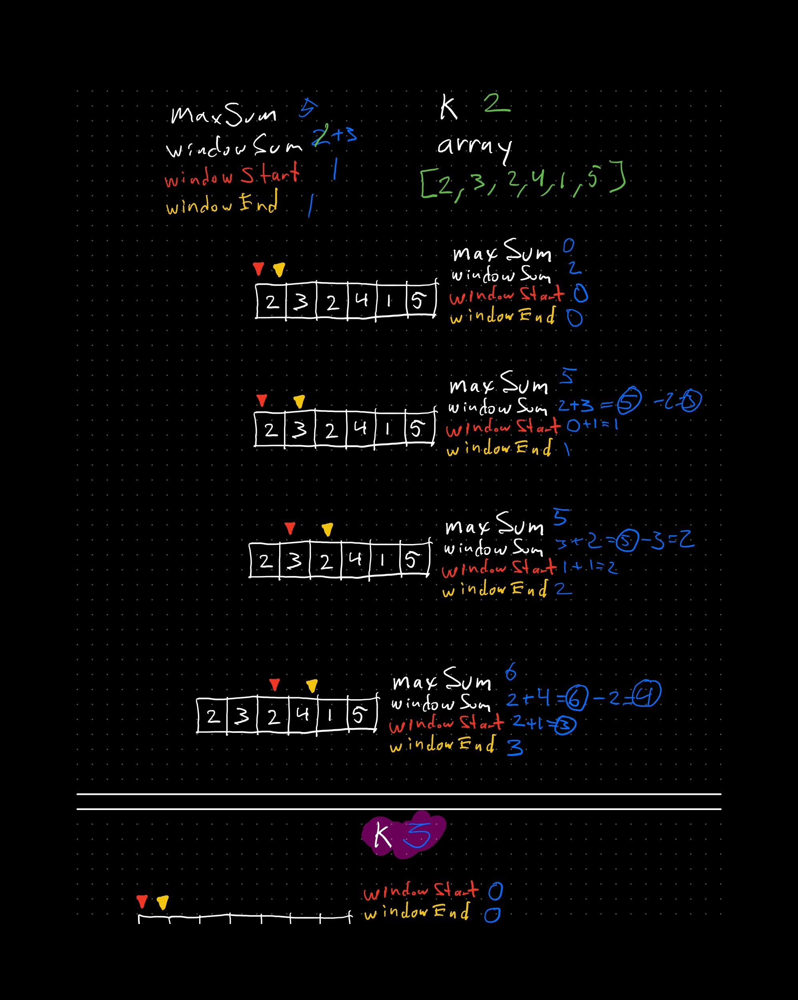
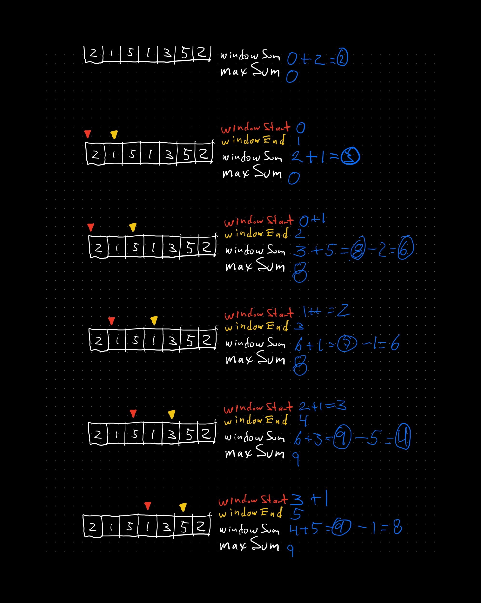
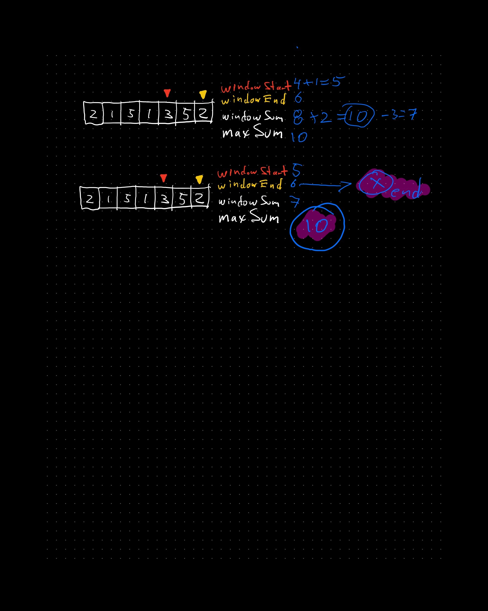

# Max Subarray Problem Solution Using Sliding Window Algorithm

## Introduction

The Max Subarray problem involves finding the contiguous subarray within a one-dimensional numeric array that has the largest sum. One efficient way to solve this problem is by using the sliding window algorithm.

## Sliding Window Algorithm

The sliding window algorithm is a technique that involves creating a window that slides over the array to examine different parts of it. This approach helps in reducing the time complexity of the problem.

## Steps to Solve the Problem

1. **Initialize Variables**:
   - `max_sum` to store the maximum sum found.
   - `current_sum` to store the sum of the current window.

2. **Iterate Through the Array**:
   - Add the current element to `current_sum`.
   - If `current_sum` exceeds `max_sum`, update `max_sum`.
   - If `current_sum` becomes negative, reset it to 0.

3. **Return the Result**:
   - The `max_sum` will contain the maximum sum of the subarray.

## Pseudocode

```python
def max_subarray(nums):
    max_sum = float('-inf')
    current_sum = 0
    
    for num in nums:
        current_sum += num
        if current_sum > max_sum:
            max_sum = current_sum
        if current_sum < 0:
            current_sum = 0
    
    return max_sum
```

## Example

Consider the array: `[-2,1,-3,4,-1,2,1,-5,4]`

- Initialize `max_sum` to `-inf` and `current_sum` to `0`.
- Iterate through the array:
  - Add `-2` to `current_sum` → `current_sum = -2`
  - `current_sum` is less than `0`, reset `current_sum` to `0`
  - Add `1` to `current_sum` → `current_sum = 1`
  - `current_sum` is greater than `max_sum`, update `max_sum` to `1`
  - Continue this process...

The maximum subarray sum is `6` for the subarray `[4, -1, 2, 1]`.

## Visualization

This images show how the "window" go through the array and "collect" the max sum







## Conclusion

The sliding window algorithm provides an efficient way to solve the Max Subarray problem with a time complexity of O(n). This method ensures that we only pass through the array once, making it optimal for large datasets.